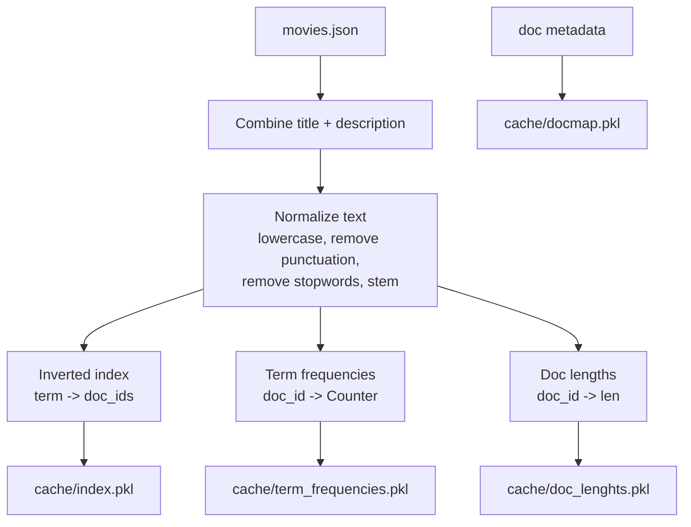
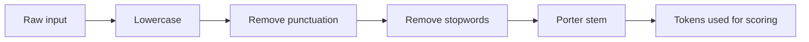
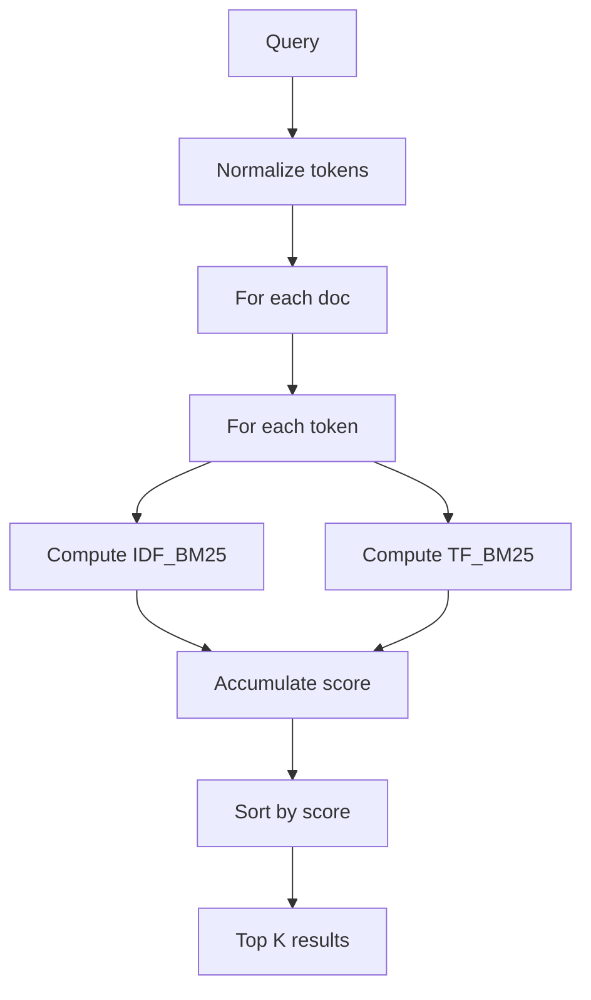

# RAG Search Engine (BM25 + TF-IDF Keyword Search)

This repo implements a compact keyword search engine over a movie dataset. It builds an inverted index, stores per-document term frequencies, computes TF-IDF and BM25 scores, and exposes these operations via a CLI.

The project is designed for learning and experimentation with classic IR (information retrieval) algorithms.

## Quick Start

1. Build the index cache.

```bash
python3 cli/keyword_search_cli.py build
```

2. Run BM25 search.

```bash
python3 cli/keyword_search_cli.py bm25search "dream within a dream" 5
```

3. Compute term statistics.

```bash
python3 cli/keyword_search_cli.py tf 12 matrix
python3 cli/keyword_search_cli.py idf matrix
python3 cli/keyword_search_cli.py tfidf 12 matrix
python3 cli/keyword_search_cli.py bm25idf matrix
python3 cli/keyword_search_cli.py bm25tf 12 matrix 1.5 0.75
```

## Data Flow Overview

The core pipeline is:

1. Load movies from `data/movies.json`.
2. Combine title + description per movie.
3. Normalize text: lowercase, remove punctuation, remove stopwords, apply Porter stemming.
4. Build:
   - Inverted index (`term -> [doc_id, ...]`)
   - Per-document term frequencies (`doc_id -> Counter(term)`)
   - Document lengths (`doc_id -> length`)
5. Save caches to `cache/`.



## CLI Commands (Routes)

The CLI is `cli/keyword_search_cli.py`. Commands:

1. `build`
   - Builds and writes the caches from the dataset.
   - Files produced in `cache/`:
     - `index.pkl`
     - `docmap.pkl`
     - `term_frequencies.pkl`
     - `doc_lenghts.pkl`

2. `search <query>`
   - Intended to run a search. Currently it loads the index but does not execute a search.

3. `tf <docid> <term>`
   - Returns term frequency of `term` in `docid` after normalization.

4. `idf <term>`
   - Computes inverse document frequency for `term`.

5. `tfidf <docid> <term>`
   - Computes TF-IDF using `tf * idf` after normalization.

6. `bm25idf <term>`
   - Intended to compute BM25 IDF, but currently does not print or return it in CLI.

7. `bm25tf <doc_id> <term> [k1] [b]`
   - Computes BM25 TF component for `term` in `doc_id`.
   - Defaults: `k1=1.5`, `b=0.75`.

8. `bm25search <query> [limit]`
   - Runs BM25 search and prints top results.
   - Default `limit=5`.

## Text Normalization Pipeline

Normalization is consistent with the indexer, and is required for queries to match indexed terms.

Steps:

1. Lowercase
2. Remove punctuation
3. Remove stopwords
4. Porter stemming



## Inverted Index

The inverted index maps each normalized term to a list of document IDs containing the term.

- `index["dream"] -> [3, 11, 25, ...]`

This allows fast candidate retrieval for term-based operations.

## TF (Term Frequency)

`TF(term, doc)` is the count of `term` in `doc` after normalization.

```
TF(term, doc) = count(term in doc)
```

Computed in `InvertedIndex.get_tf` using the stored `Counter` for each document.

## IDF (Inverse Document Frequency)

IDF measures how rare a term is across the corpus.

Implementation in `keyword_search_cli.py`:

```
IDF(term) = log((N + 1) / (DF(term) + 1))
```

Where:
- `N` = number of documents
- `DF(term)` = number of documents containing the term

The `+1` smoothing avoids division by zero.

## TF-IDF

TF-IDF combines TF and IDF.

```
TFIDF(term, doc) = TF(term, doc) * IDF(term)
```

Used to measure how relevant a term is to a document, relative to the corpus.

## BM25

BM25 is a ranked retrieval function that extends TF-IDF with term saturation and document length normalization.

### BM25 TF Component

```
TF_BM25 = (tf * (k1 + 1)) / (tf + k1 * L_d)
```

Where:
- `tf` = term frequency in document
- `k1` = term saturation parameter (default 1.5)
- `L_d` = length normalization term

```
L_d = 1 - b + b * (doc_len / avg_doc_len)
```

`b` controls length normalization strength (default 0.75).

### BM25 IDF Component

```
IDF_BM25 = log((N - DF + 0.5) / (DF + 0.5) + 1)
```

### BM25 Score

For a query with tokens `t1..tm`:

```
BM25(doc, query) = sum(IDF_BM25(ti) * TF_BM25(ti, doc))
```

### BM25 Search Workflow



## Files and Modules

- `cli/keyword_search_cli.py`:
  - CLI entry point and command routing.
  - Implements TF, IDF, TF-IDF calculation logic.

- `cli/Inverted_Index.py`:
  - Core index builder and BM25 functions.
  - Loads/saves cache files.

- `data/movies.json`:
  - Movie dataset (title, description, id, etc.).

- `data/stopwords.txt`:
  - Stopword list used during normalization.

- `cache/`:
  - `index.pkl`, `docmap.pkl`, `term_frequencies.pkl`, `doc_lenghts.pkl`.

## Observed Inconsistencies / Mistakes

1. `search` command in `cli/keyword_search_cli.py` loads the index and then does nothing.
2. `bm25idf` command calls `get_bm25_idf` but never prints or returns the value.
3. `idf` in CLI normalizes with stopwords + stemming but does not lowercase; index terms are lowercased, so casing mismatches can happen.
4. `tfidf` computation uses `Obj.index[str(args.term)]` without preprocessing the term, which can miss or throw `KeyError` for terms not in raw form.
5. `tfidf` path calculates `clean_query` but does not use it for scoring.
6. Two different implementations of `filter_stopwords_stemming` exist (`cli/keyword_search_cli.py` and `cli/Inverted_Index.py`) with slightly different behavior and data sourcing.
7. Hardcoded repo-specific absolute paths (`~/Krish/RAG/rag-search-engine/...`) reduce portability.
8. Cache file name is `doc_lenghts.pkl` (typo: “lenghts”), which is consistent internally but error-prone for tooling.
9. `bm25tf` CLI accepts `b` as an argument but does not pass it into `get_bm25_tf` in `keyword_search_cli.py` (only `k1` is passed), so `b` is ignored.
10. `bm25_idf_command` wrapper computes value and discards it.
11. Some unused variables exist (e.g., `clean_query` in `tfidf` path).
12. `cli/Old_*.py` files are present and may cause confusion about which implementation is active.
